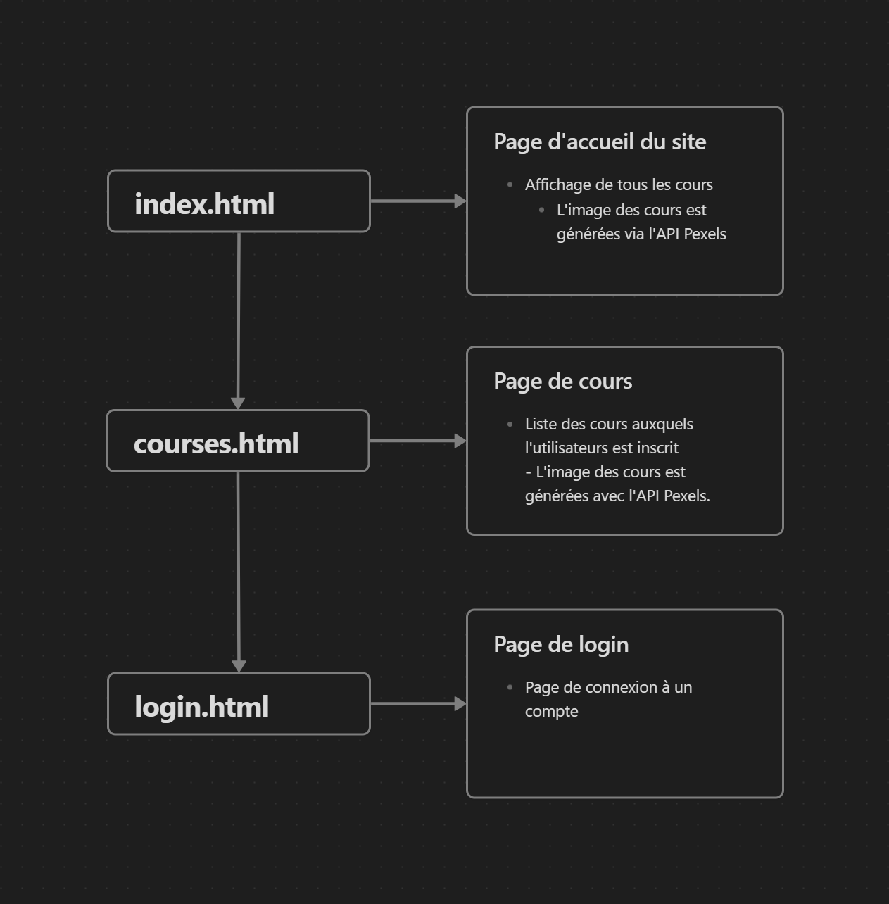
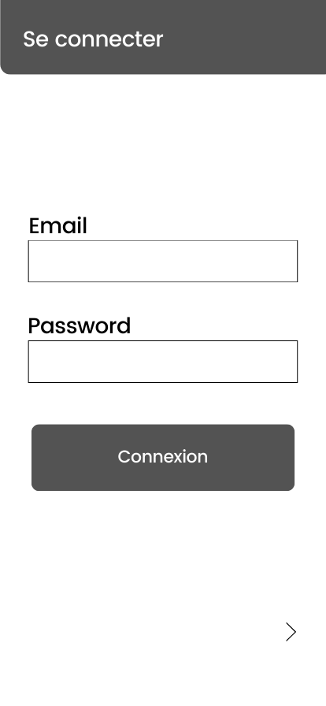
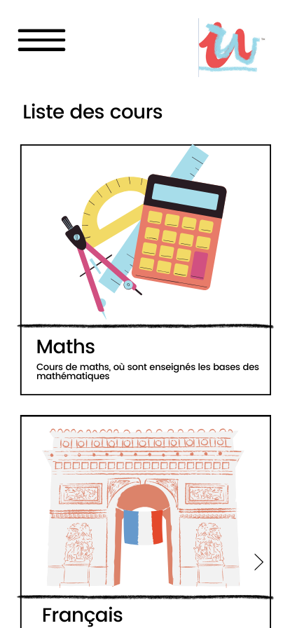
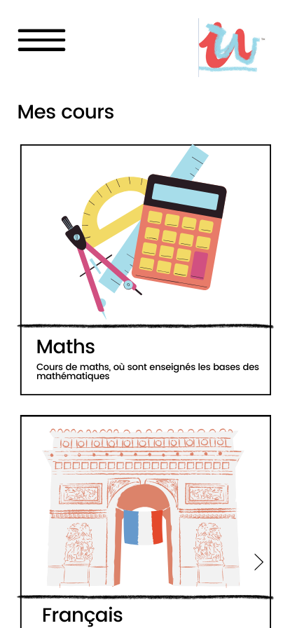
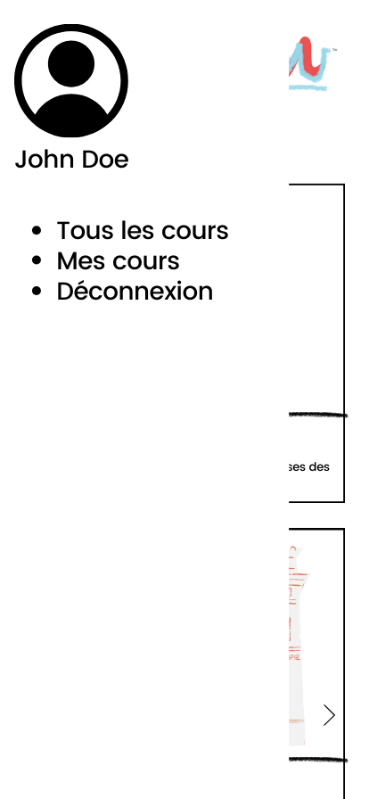

# Déploiement
L'application est déployée sur l'adresse suivante : https://pda.tomatebanane.ch/es2-2023-2024/karel.svbd/  
Pour plus de détail sur la partie backend/api, consultez le [dépôt GitHub du backend](https://github.com/KarelSvbd/BackendUdewish)
# Structure frontend
## Frontend
- Uitilsation d'HTML/CSS
	- Template pris sur W3.CSS
- Utilisation de TypeScript
	- Appels API
	- Retourner des données à afficher
### Structure frontend
Pour chaque fichier HTML, on retrouve dans le projet un fichier TypeScript et un fichier JavaScript généré à partir du fichier TypeScript.

Le frontend se trouve dans le dossier "frontend" :
- index.html
	- index.js
	- index.ts
	- Page d'accueil du site
		- Affichage de tous les cours
			- L'image des cours est générées avec l'API Pexels.
- courses.html
	- courses.js
	- courses.ts
	- Liste des cours auxquels l'utilisateurs est inscrit
		- L'image des cours est générées avec l'API Pexels.
- login.html
	- login.js
	- login.ts
	- Page de connexion à un compte



# Maquettes

## Page de connexion




## Page liste des cours
Affichage de tous les cours disponibles. Il suffit de cliquer sur un cours pour s'y inscrire.




## Page cours inscrits
Affichage des cours auxquels l'utilisateur est actuellement inscrit.




## Menu déroulant



# Cas d'utilisation

#### 1A - l'utilisateur arrive sur le site (page de connexion)
L'utilisateur saisi ses informations de connexion:
- L'utilisateur réussi à se connecter, il va au cas 2A
- La connexion échoue il retourne au cas 1A
#### 1B - L'utilisateur est déjà connecté
L'utilisateur est redirigé sur le cas 2A au lieu de devoir se reconnecté grâce "cookie" de connexion.
#### 2A - L'utilisateur est redirigé sur la page d'accueil (liste des cours)
Tous les cours sont affichés l'utilisateur peut cliquer sur un cours pour s'y inscrire, il est redirigé sur le cas 3A.
L'utilisateur peut également ouvrir le menu déroulant sur le coté, il est redirigé au cas 3A.
#### 3A - Le menu déroulant s'affiche
L'utilisateur à le choix entre plusieurs options:
- Afficher tous les cours disponible -> L'utilisateur est redirigé au cas 2A
- Afficher les cours auxquels il est inscrit -> L'utilisateur est redirigé au cas 5A
- Se déconnecter -> L'utilisateur est redirigé au cas 6A
#### 4A - L'utilisateur doit valider ou annuler son inscription à un cours
Une popup apparaît avec 2 options, valider ou annuler l'inscription à un cours:
- L'utilisateur valide l'inscription -> un message l'indique qu'il a bien été inscrit, il est redirigé au cas 2A
- L'utilisateur annule l'inscription -> un message lui indique qu'il a bien annulé son inscription, il est redirigé au cas 2A
#### 5A - L'utilisateur est redirigé sur la page des cours
L'utilisateur voit tous les cours auxquels il est inscrit.
L'utilisateur peut également ouvrir le menu déroulant sur le coté, il est redirigé au cas 3A.
#### 6A - L'utilisateur se déconnecte
L'utilisateur se déconnecte, il est redirigé au cas 1A.
# Exemple d'appel API

L'extrait de code ci dessous est tiré du fichier index.ts, qui a pour but d'afficher la liste des cours de la base de données MongoDB dans l'HTML tout en utilisant l'API Pexels pour choisir l'image des cours.

Les informations passé à l'API Pexels pour choisir l'image d'un cours sont :
- Le nom du cours
- La description du cours

Pour chaque cours parcouru, une image est récupérée via Pexels et le cours est ensuite affiché dans l'HTML.

```ts
import { createClient, Photo } from 'pexels';

// Stockage de la clef API
const apiKey = 'insert you api kex';

// URL de l'API qui renvoie la liste des cours
const apiUrl = 'http://10.5.51.40:3000/courses';

fetch(apiUrl)
  .then(response => {
    if (!response.ok) {
      throw new Error('HTTP error ' + response.status);
    }
    return response.json();
  })

  .then(data => {
    let index = 0;
    data.forEach((cours: any) => {
      var myHeaders = new Headers();
      
      // Ajout de la clef API
    myHeaders.append("Authorization", apiKey);

    let requestOptions : RequestInit = {
      method: 'GET',
      headers: myHeaders,
      redirect: 'follow'
    };

	// Définition d'une image par défaut
    let image = "csharpicon.png";
    
   // Requête API avec les paramètres du cours parcouru
    fetch(`https://api.pexels.com/v1/search?query=${cours['name']}${cours['category']}&per_page=1`, requestOptions)
      .then(response => response.text())
      .then(result => {
        let resultArray = JSON.parse(result);
        image = resultArray['photos'][0]['src']['medium'];
        const listecours = document.querySelector("#listecours") as HTMLElement;
        if(index % 3 == 0){
          listecours.innerHTML += `<div class="w3-row-padding">`;
        }

       // Ajout du cours parcouru dans l'HTML
        listecours.innerHTML += `
          <div onclick="ClickCourse('${cours['_id']}', '${cours['name']}')" class="w3-third w3-container w3-margin-bottom" style="color: red;">
            
            <div class="w3-container w3-white">
              <p><b>${cours['category']}, ${cours['name']}</b></p>
              <p>${cours['description']}</p>
            </div>
          </div>
        `;
        if(index % 3 == 0){
          listecours.innerHTML += `<div>`;
        }
        index++;
      })
      .catch(error => console.log('error', error));
    });
  })
  .catch(error => {
    console.error('Error fetching data from API:', error);
  });
```

# Index DB
Index DB est utilisé pour stocker localement les informations de l'utilisateur ainsi qu'un "cookie" de connexion.

### Informations stockées de l'utilisateur :
- Id
- Nom
- Prénom
- Cours enregistré

### "Cookie" de connexion
Si l'index DB n'est pas vide, c'est que l'utilisateur est connecté.
```ts
// Fonction qui vérifie si il y a des informations dans l'index DB
function checkIndexedDBData(callback : any) {

  const db = request.result;
  if (db) {
    const transaction = db.transaction("myObjectStore", "readonly");
    const objectStore = transaction.objectStore("myObjectStore");
    const getAllRequest = objectStore.getAll();
  
    getAllRequest.onsuccess = (event) => {
      const data = getAllRequest.result;

      if (data && data.length > 0) {
        callback(true);
      } else {
        callback(false);
      }
    };

    getAllRequest.onerror = (event) => {
      console.error("Error checking IndexedDB: " + getAllRequest.error);
    };

  } else {
    console.error("IndexedDB is null");
  }
}
```

### Déconnexion
L'index DB est vidé et l'utilisateur est redirigé sur la page de connexion

la fonction ```logout()``` est appelée au clique sur le bouton de déconnexion.
```ts
// Fonction de déconnexion
function logout(): void {
  // Supprimer toutes les données de IndexedDB
  clearIndexedDBData();
  // Rediriger vers la page d'accueil
  window.location.href = "./login.html";
}
```

Ensuite, la fonction ```clearIndexDBData()``` est appelée pour vider l'index DB
```ts
// Fonction pour supprimer toutes les données de IndexedDB
function clearIndexedDBData(): void {
  // Ouverture de la base de données
  const indexedDBRequest = indexedDB.open("myDatabase", 1);
  indexedDBRequest.onsuccess = (event: Event) => {
    // Récupère la base de données
    const db = (event.target as IDBOpenDBRequest).result;
    const transaction = db.transaction("myObjectStore", "readwrite");
    // Récupère la table myObjectStore
    const objectStore = transaction.objectStore("myObjectStore");
    // Supprimer tous les enregistrements
    objectStore.clear();
  };
}
```