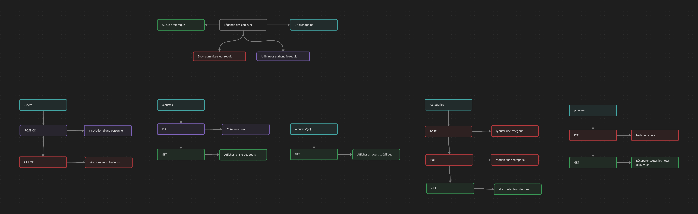
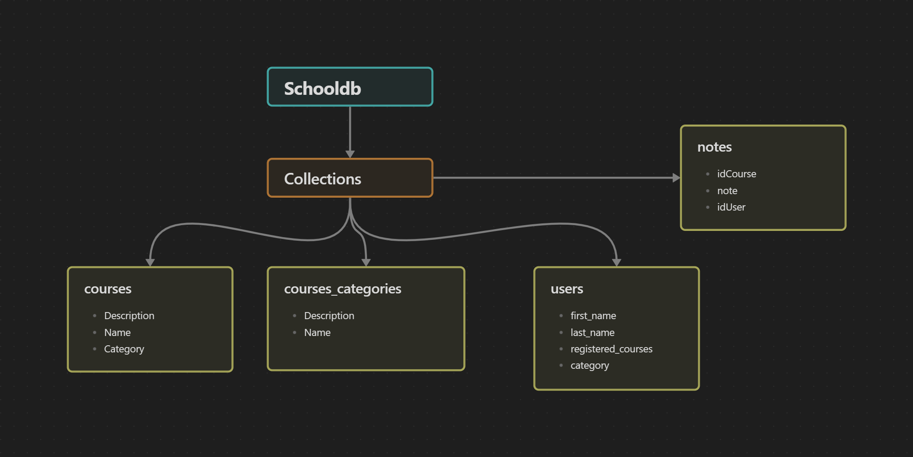

# Réalisation de l'API

Pour réaliser l'API nous avons utilisé Node JS pour le développement et Postman pour effectuer les différents tests.
## Endpoints API (Schéma)

Voici la liste des endpoints API que nous avons déterminé.

## Endpoints API (Node JS/Postman)

// À remplir

# Base de données
## Mongo DB

Le moteur de base de données utilisé dans le cadre de ce projet est Mongo DB.
La base de données est hébergée sur un serveur distant à l'aide de [Atlas](https://www.mongodb.com/atlas/database).

## Outils utilisés

Les différents outils que nous avons utilisés pour la réalisation de la base de données :
	- Mongo DB Compass
	- Mongosh (Shell Mongo DB)
	- Mongo DB Atlas
### Schéma de la base de données

